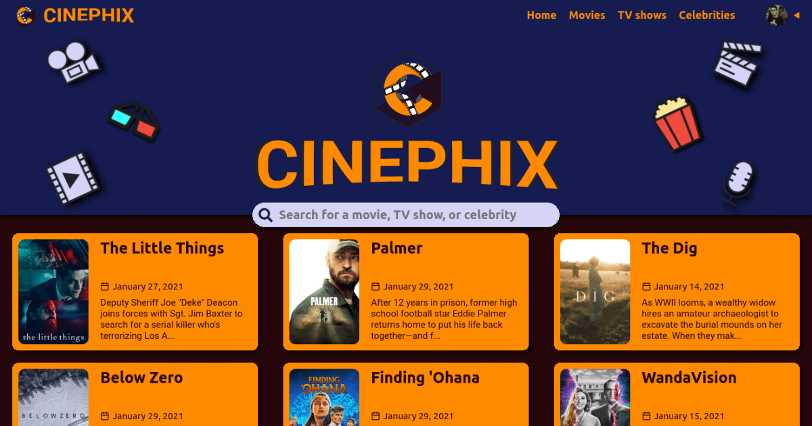

# Cinephix

Cinephix is the application made for cinephiles, where people passionate about movies and TV shows can pursue their interest.

This is the API of it, which is available at [api.cinephix.com](https://api.cinephix.com).

## Features

- Communication with [The Movie Database API](https://developers.themoviedb.org/3/getting-started/introduction).
- CRUD of users.
  - Movies
  - TV shows
- CRUD of events.
- CRUD of groups.

## Technologies

- [JavaScript](https://www.javascript.com)
- [TypeScript](https://www.typescriptlang.org)
- [Node.js](https://nodejs.org/en/)
- [Express](https://expressjs.com)
- [MongoDB](https://www.mongodb.com)
- [TMDb](https://developers.themoviedb.org/3/getting-started/introduction)
	> Database for media data

## Associated repositories

- [cinephix](https://github.com/iago-mendes/cinephix)
	> Main website
- [cinephix-links](https://github.com/iago-mendes/cinephix-links)
	> Redirect setup for links
